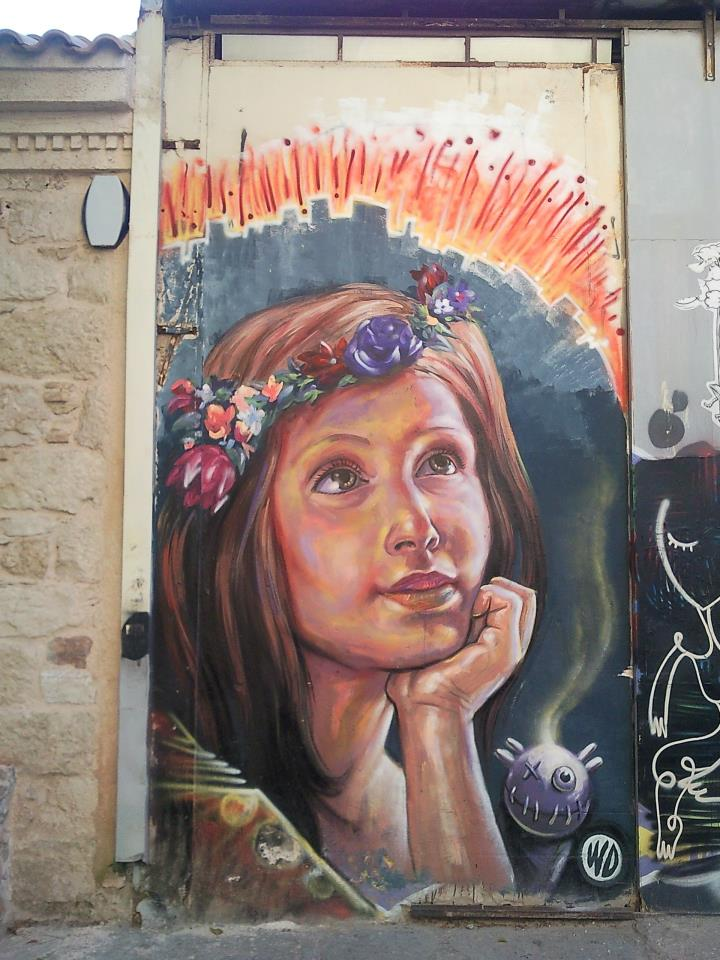
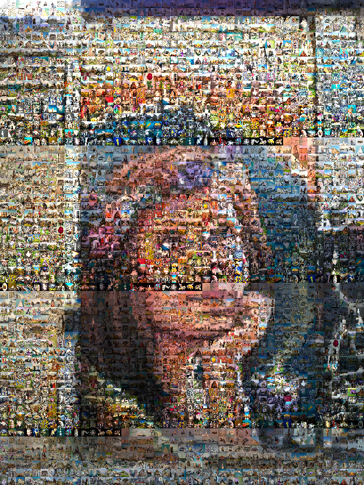

# image-mosaic

Create an image mosaic from image archive. Demo notebook is at [image_mosaic.ipynb](image_mosaic.ipynb)

The example input is fresco.jpg

the associate output is mosaic.png

The image archive used is from [DIV2K dataset](http://data.vision.ee.ethz.ch/cvl/DIV2K/DIV2K_train_HR.zip)
